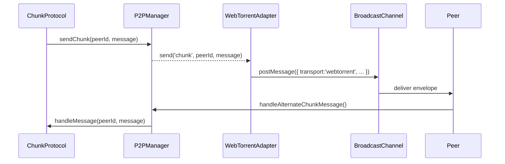

# RFC: WebTorrent bridge integration

## Background

The WebTorrent bridge is a resilience milestone called out in the [Resilience integration note](../../Resilience.md).
PeerJS remains the primary transport for browser-to-browser data channels, but WebTorrent extends the mesh with a
tracker/DHT-backed swarm. The goals are:

1. Reduce time-to-peer when rendezvous workers are saturated or offline.
2. Preserve chunk replication guarantees even when PeerJS cannot deliver a request in time.
3. Produce telemetry that informs when fallback paths are exercised and whether they succeed.

## Scope

This RFC focuses on the application-layer integration required by the SPA:

* Transport adapters: `src/lib/p2p/transports/webtorrentAdapter.ts`.
* Manager orchestration: `src/lib/p2p/manager.ts`.
* Feature gating: `src/config/featureFlags.ts`.
* Dashboard visibility: `src/components/p2p/dashboard/NodeStatusOverview.tsx`.

The complementary operations work (benchmarks, threat model) is tracked separately.

## Activation controls

* Feature flag `webTorrentTransport` (see `src/config/featureFlags.ts`).
* Runtime toggle hooks in the P2P manager via `subscribeToFeatureFlags`.
* Dashboard exposes state by reading `stats.transports`.

Flags can be enabled via `VITE_FEATURE_WEBTORRENT=true` at build-time or toggled with `updateFeatureFlags({ webTorrentTransport: true })` at runtime.

## Data flow

### Outbound (fallback)

When PeerJS returns `false` for a send attempt, the manager records a fallback diagnostic and routes the message through the adapter. The adapter attempts a WebTorrent extension payload first; if the library is unavailable the BroadcastChannel shim delivers a structured message to local test harnesses.

### Inbound

* BroadcastChannel and any WebTorrent `wire` hooks feed `onMessage('chunk', ...)` handlers.
* The manager updates peer activity, records the transport as `active`, and hands the payload to the existing chunk protocol.

### Telemetry

* Every fallback increments `stats.transportFallbacks` and the WebTorrent entry in `stats.transports`.
* Dashboard renders the fallback counters, last fallback timestamp, and current state badge.

## Security + privacy

* The adapter never stores payload data beyond the envelope forwarded to the chunk protocol.
* BroadcastChannel fallback is scoped to the current origin and is only active when the window API exists.
* WebTorrent attempts to send custom extension frames tagged `swarm-space`. Without peers that support the extension, the fallback defaults to BroadcastChannel, so no plaintext leak occurs to third parties.
* Diagnostics include transport identifiers but omit payload hashes.

## Failure handling

* If WebTorrent cannot import, the adapter reports a `degraded` state and the dashboard displays a warning badge.
* Failed sends update `lastError` to aid debugging.
* Disabling the feature flag tears down the adapter and resets counters.

## Open items

* Swap the BroadcastChannel compatibility layer for real WebTorrent extension messaging once peer implementations are ready.
* Add tracker configuration to the rendezvous mesh config once the operations team publishes the canonical tracker list.
* Capture wire-level metrics (DHT join latency, swarm size) once the real bridge is active.
